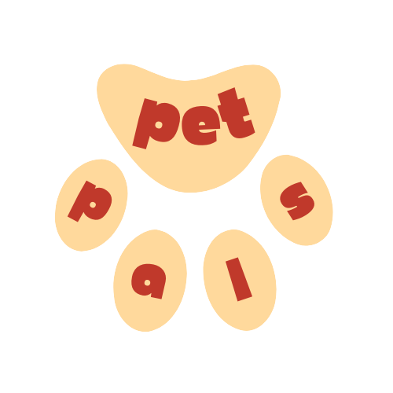

# Introduction

PetPals is a mobile application designed to help pet rescue organizations get off to a good start. This document serves as a guide to using the PetPals app and outlines the features and navigation integrated into the application.

# Navigation

1. **Home**: The Home button on the navigation bar takes users back to the main screen of the application, serving as the starting point for accessing all other features and functionalities.

2. **Pet Listings**: The Pet Listings button on the navigation bar provides users with access to photos and brief descriptions of 10 pets available for adoption. Users can filter by type of animal, breed, age, and location.

3. **Pet Details**: When users click on a specific pet, they will be taken to a screen that includes more detailed information about the animal, such as its personality, medical history, and any special needs. This screen will also include buttons to adopt or foster the pet, as well as options to share the pet's profile on social media.

4. **Donations**: The Donations button on the navigation bar includes information about the organization's fundraising efforts and a link to make a donation. Users can choose from different donation amounts and payment options.

5. **Volunteer**: The Volunteer button on the navigation bar includes information about volunteering opportunities, such as event planning, fundraising, social media management, and animal care. Users can fill out a volunteer application directly within the app.

6. **Search & Rescue**: The Search & Rescue button on the navigation bar allows users to report stray animal sightings by placing a pin on a map, attach key information, and conveys this information to local shelters.

7. **Contact**: The Contact button on the profile page includes the organization's contact information, including its phone number, email address, and physical address. Users can also submit a contact form directly within the app.

# Installing the Application

The application is created using .NET 6, and can be downloaded directly from the App Store or Google Play Store. PetPals’s app icon will appear as such on both app marketplaces:

# Copyright Material Sources

The Creative Commons license for the application is an Attribution-NonCommercial: CC BY-NC. This license lets others tweak PetPals non-commercially as the content of our application is publicly available and follows copyright compliance.

All of the icons used in the app are from Font Awesome, a General Purpose License friendly database of commercially available icons. As well as this, all of the Mud Blazor Components used in our application are open source and free for commercial use.

# App Project Description
PetPals is a mobile application designed to help new pet rescue organizations get off to a good start. The app features six main navigation buttons, including Home, Pet Listings, Pet Details, Donations, Volunteer, and Search & Rescue. It was developed using Blazor, a framework feature of ASP.NET for building interactive web UIs using C#, and the differing pieces of code were written on Visual Studio and brought together using GitHub. The app was made to account for different devices, platforms, and capabilities, while integrating most of the features inside of the app, such as social media sharing, a gradebook, and a transportation system for pets. With PetPals, users can easily browse pet listings, learn more about individual animals, donate to the organization, volunteer, and get in touch with the organization. The app was designed to be used by pet rescue organizations all around the world to better the process of communication and streamline the pet adoption process.